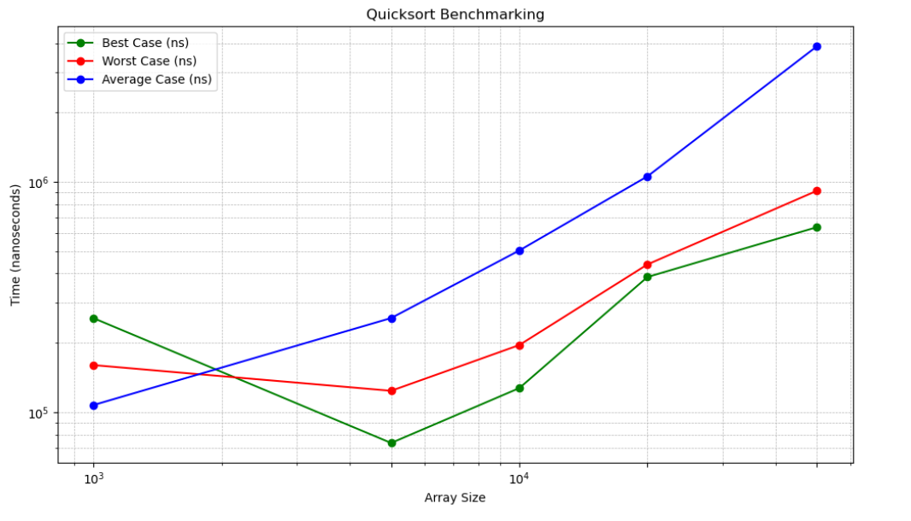
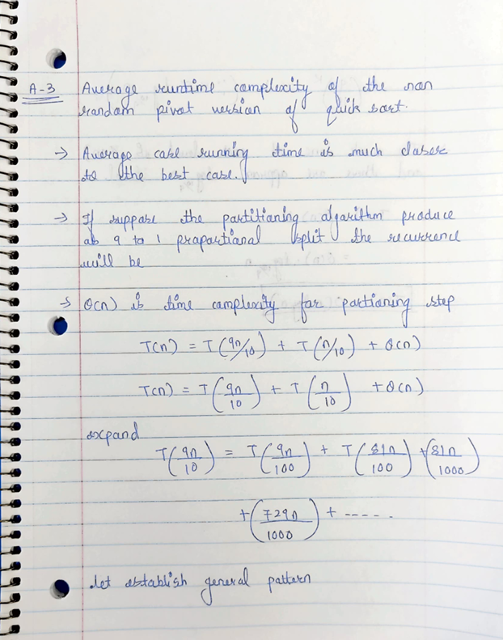
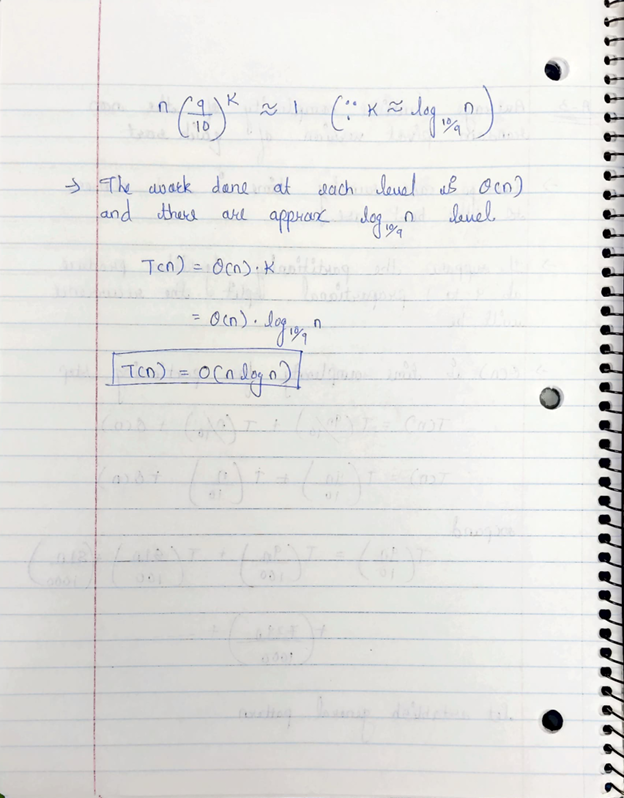

# HandsOn_6

# Problem 1

* Code for QuickSort with Random Pivot  is  [`QuickSortRandom.py`](QuickSortRandom.py)

* Code for QuickSort with NonRandom Pivot  is  [`QuickSortNonRandom.py`](QuickSortNonRandom.py)

# Problem 2

* Code for Benchmark is given [`NonRandomBenchmark.py`](NonRandomBenchmark.py)
 
 

# Problem 3

[def]: Benchmark.png
